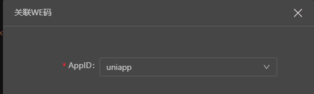
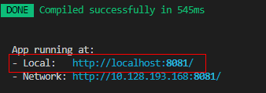
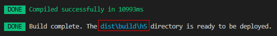

## We码集成uniapp说明

### 第一步：支持开发环境调用We码的JSAPI

1、先安装We码的依赖包
```
npm install @wecode/wlk-jsapi
```
2、增加vue.config.js文件，在此文件的 devSerer 中，引入We码的JSAPI；并在打包的时候复制 plugin.json，上传包需要用到。

引入We码JSAPI的路径为 `@wecode/wlk-jsapi/lib`。

引用路径举例说明，`dist/build/h5`为编译完之后的目录：

若 `dist/build/h5/index.html`，则引用层级为 `../../../common/js/hwh5.js`；

若 `dist/build/h5/html/index.html`, 则引用层级为 `../../../../common/js/hwh5.js`

配置示例如下：

**vue.config.js**

```js
const path = require('path');
const webpack = require('webpack');
const express = require('express');
const CopyPlugin = require('copy-webpack-plugin');


module.exports = function () {
  const { WECODE_PLATFORM } = process.env;
  const ISLOCALDEV = process.env.NODE_ENV === 'development';
  const targetPluginPath = './plugin.json';
  const buildPluginPath = `${process.env.UNI_OUTPUT_DIR}/plugin.json`;

  return {
    devServer: {
      before: function (app, server, compiler) {
        if(WECODE_PLATFORM) { 
          // 1、开发时引入We码JSAPI
          const platform = process.env.UNI_PLATFORM;
          const commonPath = path.join(__dirname, 'node_modules/@wecode/wlk-jsapi/lib');
          if (platform === 'h5') { // We码本地调试，引入 jsapi common 包
            app.use(express.static(path.join(commonPath))); // common 包路径
          }
        }
      }
    },
    configureWebpack: {
      plugins: [
        WECODE_PLATFORM && new CopyPlugin([
          // 2、编译时复制根目录的plugin.json至编译完之后的目录
          !ISLOCALDEV && { from: targetPluginPath, to: buildPluginPath }
        ].filter(Boolean)),
        WECODE_PLATFORM && new WeCodeCheckDoneHooksPlugin({
          head: {
            links: ['../../../common/css/hwh5.css']
          },
          body: {
            scripts: ['../../../common/js/hwh5.js']
          }
        }),
        WECODE_PLATFORM && new webpack.DefinePlugin({
          'process.env.WECODE_PLATFORM': JSON.stringify(WECODE_PLATFORM)
        })
      ].filter(Boolean)
    }
  }
}
```
在终端执行 `npm run serve`，启动完成后，可在页面中输出下HWH5，查看对象属性，确保引入引用成功：
```js
console.log(HWH5);
```
如果有输入信息则代表引入成功。

### 第二步：引入Polyfill补丁，使用uniapp的JSAPI即可调用到We码的JSAPI

1、在入口文件 `main.js` 的头部，引入 `wecode.polyfill`。

```js
import Vue from 'vue'
import App from './App'
import './wecode.polyfill'; // 新增
```

`wecode.ployfill.js` 文件说明：将页面中调用 uniapp 的 API 转换成 We 码的API。
具体实现，请参考[wecode.polyfill.js解析](./wecode.polyfill.md)。

2、调用示例：
```
uni.request({
  url: 'http://w3.huawei.com/next/service/rest/my/w3account/v1/account/zh?profile=1&version=1&usergroup=1',
  method: 'GET',
  header: {
    'content-type': 'application/json'
  },
  timeout: 6000,
  success(res) {
    console.log('request服务端返回数据：', res);
  },
  fail(error) {
    console.log('系统返回异常', error);
  }
})
```
其他API的调用方式可在 [uniapp官网](https://uniapp.dcloud.io) 查看，其中只适配了We码 的部分 JSAPI，适配文件请参考 [uniapp适配We码JSAPI的文档说明](./uniapp适配We码JSAPI的文档说明.md)

### 第三步：在项目中新增 plugin.json 和 wecode.json，便于配合IDE使用

配置内容如下：

**plugin.json**
```json
{
  "indexURL": "h5://671583413029779/index.html?v=1",
  "appId": "671583413029779",
  "minSdkVersionName": "1.0.25",
  "versionName": "1.0.3"
}
```
配置后可以使用IDE的“预览”功能，然后在真机上进行测试。
字段说明：

1、`indexURL`: 如上是h5的首页地址。

2、`appId`: 点击预览时需要的关联APPID,关联成功后这边会自动填充, 如图:



**wecode.json**
```json
{
    "distPath": "./dist/build/h5",
    "serverUrl": "http://localhost:8080"
}
```

字段说明：

1、`serverUrl`: 执行启动命令 `npm run serve:mp-wecode` 后，页面输出的 Local地址，即可在浏览器中访问的地址。<font color="red">需注意，有时候端口号如果被占用了，就会使用新的端口的。且使用 IDE 的“调试”功能时，需确保已经执行好启动的命令。</font>

如图：



2、`distPath`: 执行打包命令 `npm run build:mp-wecode` 编译完之后的目录。<font color="red">使用IDE的“预览”或者“上传”前，需要先执行打包命令，以确保包是最新的。</font>

如图：


